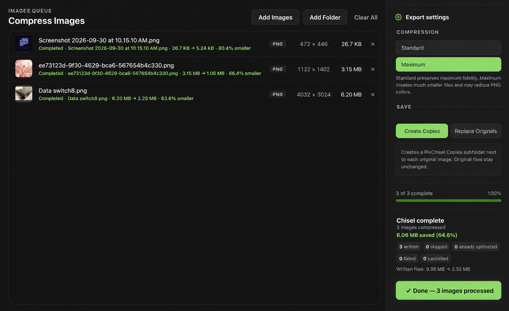

  

  <strong>Convert. Compress. Resize. Locally.</strong>

  A free, private desktop app for working with images without uploading them.

  <strong><a href="https://github.com/beljafc7/pixchisel/releases">Download PixChisel</a></strong>

## Convert, compress, and resize

- Convert JPEG, PNG, and WebP images.
- Compress images while choosing between maximum quality and smaller files.
- Resize by width, height, percentage, or bounding box.
- Process individual images or entire folders in one batch.
- Create new copies or replace originals when you choose.
- Keep every image on your computer. Nothing is uploaded.

## See PixChisel in action

## Download

Download the latest available version from
[GitHub Releases](https://github.com/beljafc7/pixchisel/releases).

PixChisel 0.5.0 is currently available as a macOS Intel build. It also runs on
Apple Silicon through Rosetta. Native Apple Silicon and Windows downloads are
coming next.

Developer and contributor information is available in the
[Technical README](TECHNICAL_README.md).
